# Database Relationship (VS Code View)

## Top-Down Structure

```text
Supabase Project
└─ PostgreSQL Database
   ├─ Schema: auth
   │  └─ auth.users (login identity source)
   │
   └─ Schema: public
      ├─ Core Identity Layer
      │  ├─ company_entities (canonical internal company)
      │  ├─ user_profiles (app profile, 1:1 with auth.users)
      │  ├─ company_user_members (user -> company membership + role, one user = one company)
      │  └─ company_entity_map (mapping table to domain records)
      │
      ├─ Market Domain (external intelligence)
      │  ├─ companies
      │  ├─ company_overview
      │  ├─ company_info
      │  ├─ company_email
      │  ├─ company_contract
      │  ├─ company_supplychain
      │  └─ company_history
      │
      ├─ Operation Domain (internal execution)
      │  ├─ operation_contracts
      │  ├─ operation_lines
      │  ├─ operation_deliveries
      │  └─ operation_stock
      │
      └─ Finance Domain (internal analytics)
         └─ finance_invoices
```

## Mermaid ER Diagram

```mermaid
erDiagram
  auth_users {
    uuid id PK
    text email
  }

  user_profiles {
    uuid user_id PK, FK
    text email
    text full_name
    uuid default_entity_id FK
  }

  company_entities {
    uuid entity_id PK
    text company_name
    text company_code
  }

  company_user_members {
    uuid entity_id FK
    uuid user_id FK
    text role
    bool is_active
  }

  company_entity_map {
    bigint map_id PK
    uuid entity_id FK
    text source_domain
    text source_table
    text source_key
    uuid market_company_id FK
    numeric confidence
    text verification_status
  }

  companies {
    uuid company_id PK
    text customer
  }

  company_overview {
    uuid company_id FK
  }
  company_info {
    uuid company_id FK
  }
  company_email {
    uuid company_id FK
  }
  company_contract {
    uuid company_id FK
  }
  company_supplychain {
    uuid company_id FK
  }
  company_history {
    uuid company_id FK
  }

  operation_contracts {
    text contract_id PK
  }
  operation_lines {
    text contract_id FK
  }
  operation_deliveries {
    text contract_id FK
  }

  finance_invoices {
    text invoice_no
    text contract_id
  }

  auth_users ||--|| user_profiles : "profile"
  company_entities ||--o{ user_profiles : "default_entity"
  company_entities ||--o{ company_user_members : "has members"
  auth_users ||--o{ company_user_members : "belongs to entities"
  company_entities ||--o{ company_entity_map : "maps to domain rows"
  companies ||--o{ company_entity_map : "market reference"

  companies ||--o{ company_overview : "company_id"
  companies ||--o{ company_info : "company_id"
  companies ||--o{ company_email : "company_id"
  companies ||--o{ company_contract : "company_id"
  companies ||--o{ company_supplychain : "company_id"
  companies ||--o{ company_history : "company_id"

  operation_contracts ||--o{ operation_lines : "contract_id"
  operation_contracts ||--o{ operation_deliveries : "contract_id"
```



## Business Rule

```text
Do not join Market directly with Operation/Finance.
Use company_entity_map as the explicit mapping layer first.

Current enforced cardinality:
- one user belongs to one customer entity (`company_user_members.user_id` unique)
- one customer entity can map many source rows
- one source row can map to many customer entities
- duplicate mapping is blocked per customer (`entity_id + source_domain + source_table + source_key` unique)
```
